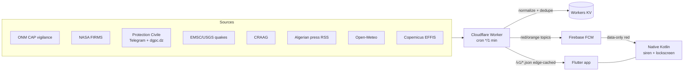

# Rad Balek (رد بالك) — Technical Documentation

> Public-safety early-warning system for Algeria: heatwaves, wildfires, floods,
> earthquakes, storms, road danger — across all 58 wilayas, trilingual (FR/EN/AR).
> **Not an official government service** — an independent relay of public data.
>
> Status: **v1.2.1** live (Firebase famille + GitHub + in-app updater). Source is
> private (public GitHub repo is README-only). This doc is internal.
> Last updated 2026-09.

---

## 1. Mission & design principles

The app exists to do one thing that no Algerian service does: **push a
life-saving alert to a phone and make it impossible to sleep through**, even in
silent mode, in Arabic and French.

Non-negotiable principles, encoded throughout the code:

1. **A missed alert is the worst outcome.** Every design trade-off favours
   over-delivery. Moderation/AI fails *open* (keeps a doubtful report visible).
2. **Notification delivery must never depend on a KV write succeeding** — a real
   3-hour outage (2026-07-19) was caused by a write quota 429 killing the cron.
   All bookkeeping writes are `try/catch` best-effort.
3. **Green is reserved strictly for "all clear."** Teal is the brand colour.
4. **The siren rides the ALARM audio stream** (`USAGE_ALARM`) — the only stream
   that survives silent/vibrate/DND.
5. **Red alerts are data-only FCM** so the native path always runs (not the
   system-notification path, which OEMs suppress).
6. **Offline-first**: the last snapshot renders instantly from disk.

---

## 2. System architecture



Three components:

- **`ingest/`** — a stateless **Cloudflare Worker**. A 1-minute cron fetches all
  sources, normalizes them into one trilingual snapshot, dedupes and pushes FCM,
  computes honest seconds-level S-wave arrival estimates for fresh felt quakes,
  and serves a JSON API. No server, no database — Workers KV + edge Cache API.
- **`app/`** — a **Flutter** app (Android; iOS planned). Native Kotlin owns the
  red-alert siren and full-screen lockscreen alert.
- **Firebase** — FCM for push only (no Firestore, no Auth, no analytics SDK).

---

## 3. Repository layout

```
algeria-ews/
├─ ingest/                         # Cloudflare Worker (Node/ESM, no framework)
│  ├─ worker.js                    # entry: cron scheduled() + fetch() router
│  ├─ run.js                       # local dev harness
│  ├─ wrangler.toml                # (gitignored) real KV id + cron
│  ├─ package.json                 # scripts: start, harvest, test
│  ├─ test/logic.test.mjs          # node --test regression suite
│  ├─ data/wilayas.json            # 58 wilaya boundary polygons (GeoJSON)
│  └─ src/
│     ├─ pipeline.js               # orchestrates all sources -> snapshot
│     ├─ capfeed.js                # ONM CAP vigilance feed (official alerts)
│     ├─ firms.js                  # NASA FIRMS satellite fire hotspots
│     ├─ telegram.js               # DGPC Protection Civile Telegram scrape
│     ├─ dgpcweb.js                # dgpc.dz WordPress REST (resilience path)
│     ├─ news.js                   # Algerian press RSS (TSA, Ennahar)
│     ├─ quakes.js                 # EMSC (primary) -> USGS (fallback)
│     ├─ craag.js                  # CRAAG official quake authority (enrichment)
│     ├─ gdacs.js                 # GDACS (JRC) big-basin flood alerts (v2)
│     ├─ weather.js                # Open-Meteo temp/wind/AQI + FWI fire risk
│     ├─ fwi.js                    # Canadian FWI (CFFWIS) computation
│     ├─ geo.js                    # point-in-polygon wilaya resolver, clustering
│     ├─ wilayas.js                # wilaya name matching (FR/AR)
│     ├─ normalize.js              # unified alert/incident model + FCM topics
│     ├─ push.js                   # FCM send, dedupe, all-clear, heartbeats
│     ├─ watchdog.js               # dead-man alerts to the maintainer
│     ├─ reports.js                # citizen reports + confirm + feedback + CSV
│     ├─ auth.js                   # shared admin bearer/query auth + lockout
│     ├─ admin.js                  # curator endpoints + AI moderation (Gemini)
│     ├─ adminui.js                # /admin mission-control dashboard (HTML)
│     ├─ ai.js                     # Gemini chat + report categorization
│     └─ xml.js                    # tiny XML/Atom parser (no deps)
└─ app/
   ├─ pubspec.yaml                 # version: X.Y.Z+build
   ├─ lib/
   │  ├─ main.dart                 # MaterialApp, provider, RTL, text scaling
   │  └─ src/
   │     ├─ app_state.dart         # the core: AppState ChangeNotifier
   │     ├─ api.dart               # worker API client
   │     ├─ models.dart            # Snapshot / AlertItem / Incident / Report
   │     ├─ strings.dart           # FR/EN/AR strings + safety actions
   │     ├─ theme.dart             # vigilance colour palette (light/dark)
   │     ├─ voice.dart             # in-app TTS replay (native owns auto-speak)
   │     ├─ regions.dart, geo_utils.dart, keys.dart
   │     ├─ screens/               # home, map, sections, settings, onboarding,
   │     │                         # consignes, chat, feedback, shell
   │     └─ widgets/               # cards, sheets, reliability, skeleton,
   │                               # transitions
   └─ android/app/src/main/kotlin/dz/radbalek/rad_balek/
      ├─ MainActivity.kt           # channels, method channel, contact/call
      ├─ RbMessagingService.kt     # FCM receive -> showRed() siren path
      └─ AlertActivity.kt          # full-screen lockscreen red face + TTS
```

---

## 4. Data sources

| Source | Module | Role | Notes / quirks |
|---|---|---|---|
| **ONM** (Office National de la Météorologie) | `capfeed.js` | **Official vigilance** (the only source that pushes loud alerts) | CAP v1.2 Atom feed. Hazards: heat/storm/wind/sandstorm/flood/cold/**other**. Severity Moderate/Severe/Extreme → yellow/orange/red. |
| **NASA FIRMS** | `firms.js` | Satellite fire hotspots (VIIRS 375 m + MODIS 1 km) | CSV; `confidence` filter (VIIRS l/n/h, MODIS 0-100). **Missing confidence = unknown, not 0** (a bug once dropped 100% of fires). 3 sensors in parallel (NOAA-20/21 VIIRS + MODIS), 18 s abort. **S-NPP VIIRS dropped 2026-09** — NASA/NESDIS ends all S-NPP delivery on 2026-11-01; NOAA-20/21 carry the VIIRS coverage. |
| **DGPC Telegram** | `telegram.js` | Protection Civile field sitreps (fires, road crashes) | Scrape of t.me/@DGPCDZ. |
| **dgpc.dz** | `dgpcweb.js` | Resilience path for the Telegram scrape | WordPress REST `/wp-json/wp/v2/posts`; needs a browser UA (WAF 403s bare UA); sits behind Cloudflare (occasional 522 → 2 retries + RSS fallback). |
| **Algerian press** | `news.js` | Hazard classes official feeds miss (floods in progress, road closures, collapses) | RSS (TSA, Ennahar, Le Soir, Echorouk — v2 added the latter two for central/south + Arabic coverage; El Watan's RSS is dead). Arabic articles place via Arabic wilaya matching. Marked **NON OFFICIEL**. |
| **EMSC/USGS** | `quakes.js` | Earthquakes | EMSC primary, USGS fallback. M≥4.5 + <6 h + a resolvable wilaya → **red push**. Onset quantised to the minute (EMSC/USGS differ by seconds → avoids double-siren). Fresh quakes (≤10 min) also get an honest S-wave arrival estimate for up to 8 positive-lead wilayas. |
| **CRAAG** | `craag.js` | Official national quake authority | **Lags days-to-weeks** — enrichment only (official magnitude + the wilaya name EMSC omits), never an alert trigger. |
| **GDACS** (JRC-CEC) | `gdacs.js` | **v2**: GLOFAS big-basin river-flood alerts (corroborating) | GeoJSON events API (no auth). **FL only**; Orange/Red → our **orange** (orange-max — a foreign model never pierces DND on its own say-so); Green or unplaceable → incident pin. Big-basin ≠ flash floods in wadis (see dead-ends). EQ/TC skipped — duplicates EMSC / ONM vigilance. `iscurrent` is the *string* `"true"`. |
| **Open-Meteo** | `weather.js` | Temp, feels-like, wind, humidity, AQI, 48 h forecast, **FWI inputs** | CC BY 4.0. |
| **Copernicus EFFIS** | (worker rasters) | Fire Weather Index raster + burnt areas | WMS layers `mf010.fwi` and `modis.ba`. MapServer returns errors as HTTP 200 + HTML → **PNG magic-byte validation** on both fetch and cache read. |

Confirmed dead-ends (do not revisit): DGF (site gone), ANRH (stale), ANBT
(geo-blocked), GloFAS/Open-Meteo-Flood (models big rivers; Algeria's killers are
flash floods in small wadis), Facebook/Waze/X.

---

## 5. Backend — Cloudflare Worker (`ingest/`)

### 5.1 Execution model

```js
export default {
  scheduled(_e, env, ctx) { ctx.waitUntil(refresh(env, /*doPush*/ true)); }, // cron */1
  fetch(req, env, ctx)    { /* JSON API router + edge cache */ },
}
```

- **Only the cron pushes.** Fetch-triggered rebuilds call `refresh(env)` with
  `doPush=false`, so concurrent invocations can never race the dedupe map and
  double-send. This invariant is tested and load-bearing.
- **`latest` is write-on-change.** The `*/1` cron can rebuild every minute, but
  KV stores the snapshot only when alerts/incidents/notifications/error sources
  change, or when the stored snapshot is older than 10 minutes.
- Per-source **timeouts** (`AbortSignal`, 8–20 s) wrapped in `Promise.allSettled`
  — one hung upstream can never block the others (the 3-h-outage class).

### 5.2 Pipeline (`pipeline.js`)

`runPipeline()` → fetch all sources (isolated failures collected in `errors[]`) →
normalize → produce one snapshot:

```jsonc
{
  "generatedAt": "ISO",
  "alerts":   [ /* AlertItem: official ONM + felt quakes (class:"alert") */ ],
  "incidents":[ /* Incident: FIRMS fires, DGPC, press, quakes (class:"incident") */ ],
  "notifications":[ { "topic":"w16_heat_red", "alertId":"..." } ],
  "stats": { "byColor":{}, "byHazard":{}, "onmEntries":N, "fireClusters":N,
             "firmsSkipped":bool, "activeAlerts":N, "incidents":N },
  "errors": [ { "source":"onm", "error":"..." } ]
}
```

**Two information classes kept strictly apart:**
- `alerts` — official (ONM) → **may notify loudly**.
- `incidents` — observations (satellite, field posts) → map pins, silent by
  default, promoted only by curation.

**Earthquake S-wave estimate:** true pre-event EEW is not possible from EMSC/USGS
catalog latency. For fresh felt quakes (`age <= 600 s`, `M >= 4.5`), `detectEew()`
computes remaining S-wave arrival seconds per wilaya from the origin time,
`V_P = 6.0 km/s`, `V_S = 3.5 km/s`, and polygon distance. Only wilayas with a
positive lead are pushed, capped at 8. The alert remains one red quake alert with
`eew: true`, `warningSeconds`, `pWaveSeconds`, `sWaveSeconds`, and `eewTargets`.

### 5.3 Wilaya resolution (`geo.js`)

`makeWilayaResolver(geojson)` → `resolve(lat, lon, maxDeg=0.5)`:
point-in-ring test against the 58 boundary polygons, then a nearest-bbox-centre
fallback within `maxDeg`. **Offshore quake epicentres** need `maxDeg=1.5` (the
0.5° default returned null → no red alert; the marine margin is where Algeria's
damaging quakes originate). Regression-tested.

### 5.4 Push & FCM (`push.js`)

**Topic format:** `w{wilayaCode}_{hazard}_{color}` (e.g. `w16_heat_red`). The app
subscribes to exactly this. **Yellow is never pushed** (`fcmTopicsFor` returns
`[]`) — it is in-app only, so a yellow expiry can't emit a false all-clear.

Delivery cycle:
1. **Red-first ordering** (stable sort) so a life-critical red is never starved by
   orange when `MAX_SENDS_PER_CYCLE` is hit.
2. **Dedupe** key = `topic:onset:expires` (content-based; ONM re-issues identical
   alerts under new ids each batch). Stored in KV `sentmap` (TTL'd).
3. **RED = data-only** message → `RbMessagingService.onMessageReceived` → siren.
   Orange/yellow/all-clear = notification messages with a channel + sound.
4. **All-clear ("Fin d'alerte"):** diff of *delivered* topics (a `delivered` set =
   sent + deduped, **not** intent) vs `activetopics`. **Skipped entirely on a
   degraded cycle** (ONM failed/empty) so an upstream blip can't tell every
   wilaya "it's over" mid-emergency. Un-sent all-clears carry forward.
5. **Adaptive crisis heartbeat** for still-active reds (`kind:"heartbeat"`,
   non-intrusive orange channel): 3-hourly for the first 12 h, then 6-hourly
   up to 72 h (v2 — was a hard max of 4 × 3 h = 12 h, which went silent on
   multi-day crises while they were still live). Native gates on `kind` so it
   never re-fires the full siren.
6. **OAuth token** (`getAccessToken`) cached in KV ~55 min; invalidated on FCM
   401/403.

### 5.5 Watchdog (`watchdog.js`)

Dead-man alerts to the maintainer via FCM topic `admin` (subscribed by turning on
"creator mode" in the app):
- `watchPipeline` — ONM source down, ≥4 sources down, push all-failed (0 sent + ≥3
  errors), or ONM-parsed-but-zero-alerts (markup drift).
- `watchStale` — `/v1/alerts.json` snapshot older than ~35 min (fires on a cache
  miss). Reports over the orange channel (not the red siren).
- `notifyAdmin` (exported since v2) — shared gate used by the fetch path too:
  `weather.js` reports Open-Meteo outages (wd:weather) — weather was the only
  source with zero watchdog coverage before v2.

### 5.6 Storage — Workers KV (the binding constraint)

**Free tier: 1000 writes/day is the limit** (reads 100k, lists 1k). Writes are the
scarce resource; the whole caching strategy exists to protect them.

Key KV entries:

| Key | Purpose | Write cadence |
|---|---|---|
| `latest` | current snapshot | on content change + at least every 10 min |
| `sentmap` | push dedupe (content keys, TTL) | write-on-change |
| `activetopics` | last cycle's delivered topics (all-clear diff) | write-on-change |
| `push:last` | last push summary (dashboard) | on-change + hourly |
| `firms:last` | last-good fires (fire-map resilience) | **write-on-change** |
| `fwi:{day}` / `burnt:{day}` | EFFIS rasters, per day | daily |
| `s:{inv}` / `history:doc` | hourly stats time series (rolled-up doc) | hourly |
| `app:latest` | in-app update banner target | at release |
| `r:{ts}:{rand}` | citizen reports | on submit |
| `fb:{inv}:{rand}` | app feedback | on submit |
| `fcm_token` | cached OAuth token | ~55 min |
| rate-limit counters | `rl:` `fbrl:` `cf:` `tp:` `tpt:` `adminrl:` `air:` | per request (TTL 1 h) |

**Edge Cache API** (free, unmetered, per-colo) fronts hot GETs so repeat reads
never touch KV. Cache key is normalized (pathname + whitelisted `lite`/`limit`
params) so a junk `?x=` can't bypass into a KV-list DoS. TTLs: alerts 120 s,
reports 600 s, history 300 s, weather 600 s, fwi/burnt **not
edge-cached** (a cached MapServer error page can't be purged on workers.dev).
`/v1/reports.csv` is also **not edge-cached** because it is admin-only PII-adjacent
export data.

### 5.7 API endpoints

| Method | Path | Purpose | Cache |
|---|---|---|---|
| GET | `/healthz` | liveness | — |
| GET | `/v1/alerts.json` (`?lite=1`) | current snapshot (lite ~4× smaller) | 120 s |
| GET | `/v1/weather.json` | per-wilaya weather + FWI | 600 s |
| GET | `/v1/wilayas.json` | the 58 wilayas | — |
| GET | `/v1/boundaries.json` | GeoJSON polygons | 86400 s |
| GET | `/v1/fwi.png` / `/v1/burnt.png` | EFFIS rasters (PNG-validated) | KV/day |
| GET | `/v1/history.json` | hourly stats time series | 300 s |
| GET | `/v1/app.json` | in-app update info (from `app:latest`) | 900 s |
| GET | `/v1/push-status.json` | last push summary | no-store |
| POST | `/v1/reports` | citizen report (AI-triaged async) | — |
| POST | `/v1/reports/confirm` | community 👍 (rate-limited 20/h) | — |
| GET | `/v1/reports.json` | community feed | 600 s |
| GET | `/v1/reports.csv` | admin-only bulk export | no-store + Bearer |
| POST | `/v1/feedback` | app feedback (rate-limited 3/h) | — |
| POST | `/v1/ai/chat` / `/v1/ai/category` | Gemini assistant / categorizer | — |
| POST | `/v1/ai/risk` | admin-only AI risk analysis | — |
| POST | `/v1/test-push` | device self-test (data-only red) | public; IP + token rate limits |
| GET | `/admin` | mission-control dashboard (HTML) | no-store |
| GET/POST | `/v1/admin/*` | overview, reports, moderate, refresh, app-latest | Bearer + lockout |

**Admin auth:** shared `src/auth.js` primitive — `Authorization: Bearer <ADMIN_KEY>`
(or `?key=` compat), with a 10-failed-tries/hour/IP lockout (`adminrl:{ip}`).
Successful auth costs no write. `/v1/admin/*`, `/v1/reports.csv`, and
`/v1/ai/risk` use it.

### 5.8 Fire risk (`fwi.js`, `weather.js`)

A real **Canadian Forest Fire Weather Index (CFFWIS)** computation — cumulative
FFMC/DMC/DC codes with a **14-day spin-up**, producing today + J+1 + J+2. Class
thresholds are **exact EFFIS bands** (11.2 / 21.3 / 38 / 50 / 70) — a publicly
defensible scale. A **fuel mask** (latitude proxy: ≥34.5° forest / ≥32.5° steppe /
<32.5° desert) suppresses the fire-risk card in the Sahara, where FWI saturates
but there is nothing to burn. The app hides the card entirely for `fuel==desert`.

### 5.9 AI moderation (`admin.js`, `ai.js`)

Gemini Flash-Lite reviews each new citizen report async (`ctx.waitUntil`),
**fail-open**: confident spam/abuse → hidden; wrong category → corrected + kept;
anything uncertain stays visible. Only ever acts on a still-`new` report.
`/v1/ai/risk` is admin-only because it can synthesize hazard analysis from
operational data. (Gotcha: `thinkingConfig:{thinkingBudget:0}` hard-400s the lite
model — never send it.)

---

## 6. Android app (`app/`)

### 6.1 State management

Deliberately **`provider` + a single `AppState` ChangeNotifier** (no
Riverpod/BLoC — the app works and shipped; a rewrite was explicitly rejected).
`AppState` owns: snapshot, weather, reports, wilaya selection, FCM topic sync,
settings. Hard-won concurrency guards:
- `refresh()` — throttled 60 s, single-flight, weather 10-min TTL, one
  `notifyListeners` per cycle.
- `syncTopics()` — serialized (`_topicsBusy`/`_topicsDirty`); **keyed on the FCM
  token** so a token rotation resubscribes (a token-agnostic diff once left a
  restored phone subscribed to nothing forever).
- `loadBoundaries()` — single-flight.

### 6.2 Offline-first

Last snapshot cached in `SharedPreferences` (`rb_cache`) and rendered instantly on
launch (`sourceStatus: cached`), then refreshed. A failed first load shows a retry
(never an infinite spinner). The home first-load shows a layout-shaped **skeleton**.

### 6.3 Screens (`shell.dart` navigation)

Home (unified status card: personal "am I safe?" + national count + local
conditions), Map (`flutter_map` + CARTO tiles; layers: vigilance choropleth,
fires, quakes, heat/wind/humidity, **FWI**, **burnt areas**; scene-cached so it
rebuilds only when data/layer/theme changes, not per zoom tick), Sections
(official alerts / nearby / terrain — **lazy lists**), Settings (wilayas, hazard
toggles, **Fiabilité** reliability checklist, Android Earthquake Alerts guide,
emergency contacts, **Texte grand**),
Consignes (offline trilingual safety guides), Report sheet, AI chat, Feedback.

### 6.4 Localization & RTL

Trilingual FR/EN/AR in `strings.dart` (`S.t(lang, key)`), full RTL via
`Directionality`. Alert time windows use LTR bidi isolates (`⁦…⁩`) so
`19:00 → 20:00` doesn't reorder in Arabic. Validity windows are **date-aware**
(a 24 h alert once rendered "19:00 → 19:00").

### 6.5 In-app update

`AppState.checkForUpdate()` fetches `/v1/app.json` (served from KV `app:latest`),
compares semver numerically against `AppState.appVersion` (kept in sync with
`pubspec`), and shows a home banner linking the GitHub APK. Publishing a release +
setting `app:latest` is the only step; every app learns within ~15 min.

---

## 7. Native Android — the siren (the critical mechanism)

The single most safety-critical, hardest-won subsystem. A **RED alert arrives as a
data-only FCM message** and must ring a loud civil-defense siren + show a
full-screen red face over the lockscreen, in silent mode, speaking AR+FR.

### 7.1 Path

`RbMessagingService.onMessageReceived` (intent-filter `priority=1`, calls `super`
to keep Dart delivery) → `showRed(data)`:
1. Force `STREAM_ALARM` to ~85 % if below 60 % (in its own try — a
   `SecurityException` here must not abort the siren).
2. Ensure the `emergency_s2` channel exists (idempotent).
3. Start a **looping MediaPlayer siren on `USAGE_ALARM`** (unconditional).
4. Post an insistent `CATEGORY_ALARM` notification whose **`setFullScreenIntent`**
   launches `AlertActivity` (the sanctioned lockscreen path — a background-service
   `startActivity` is BAL-blocked on Android 14+ and silently no-ops).

`AlertActivity` = the full-red lockscreen face (call 14 / consignes / stop). It
owns the siren + vibration + **TextToSpeech** (ducks the siren, speaks FR then AR,
un-ducks — with a French-voice availability check and an unconditional un-duck so
the siren can never stay muted).

Earthquake S-wave alerts use honest native copy: `SECOUSSE ESTIMÉE`, a `~Ns`
countdown, and `ARRIVÉE` at zero. `MainActivity` also exposes
`openSafetySettings` on the `rb/channels` method channel for the Android
Earthquake Alerts guide in Settings.

### 7.2 Hard-won lessons (do not regress)

- **Resource shrinker** strips `res/raw/*.wav` in release → `keep.xml`
  (`tools:keep="@raw/*"`, `shrinkMode="strict"`).
- **Release obfuscates resource names** → sound URIs use numeric ids
  (`android.resource://$pkg/${R.raw.rb_high}`), never names.
- **Channels are immutable** once created → ids rotate (`_s1`→`_s2`); old ones
  deleted on launch; the worker's `channel_id` must match.
- `STREAM_ALARM` is excluded from the ringer-affected streams mask → it survives
  silent/DND (why the siren uses `USAGE_ALARM`, not `USAGE_NOTIFICATION`).
- `stop()`+`release()` in **separate try blocks** — a throw from `stop()` (called
  mid-`prepareAsync`) once orphaned an unstoppable looping siren.
- `USE_FULL_SCREEN_INTENT` is **restricted on Android 14+** — the app self-reports
  the grant (Fiabilité screen) so a denial is visible and fixable.

Diagnose with `adb logcat RBSIREN:I ActivityTaskManager:I *:S`.

---

## 8. Build, signing & release

### 8.1 Artifacts

- **APK** (`flutter build apk --release`) — Firebase App Distribution, GitHub,
  sideload. Universal.
- **AAB** (`flutter build appbundle --release`) — Google Play (planned).
- Signing: `android/key.properties` → `radbalek-release.jks` (both gitignored).
  A **missing `key.properties` now fails the build loudly** (never silently
  debug-signs a "release").
- `version: X.Y.Z+build` in `pubspec.yaml` — `AppState.appVersion` MUST track the
  `X.Y.Z`; `versionCode` (`+build`) must strictly increase.

### 8.2 Release ritual (proven)

1. Bump `pubspec` version **and** `AppState.appVersion`.
2. `flutter analyze` + `cd ingest && npm test`.
3. Build APK (and AAB for Play).
4. Firebase → famille: `firebase appdistribution:distribute <apk> --app <id>
   --release-notes-file <file> --groups famille` (`GOOGLE_APPLICATION_CREDENTIALS=
   firebase-sa.json`). **Notes via file** (a multi-line CLI arg is mangled by the
   npx shim and silently drops `--groups`).
5. GitHub release via the **Git Credential Manager token** (`git credential
   fill` or GCM `get` — currently a fine-grained PAT, which CAN create releases,
   verified 2026-09-08; the old `gho_` token no longer exists): create release
   (JSON body via file), then upload the APK asset with `curl --retry 5
   --retry-delay 4 --retry-all-errors` (a bare upload can cut at `http 000`).
6. `wrangler kv key put "app:latest" --path <file>.json --namespace-id=<id>`
   (**value from a file** — an inline JSON arg gets its quotes stripped
   by PowerShell→npx→node) — or the `/admin` → Version tab. (wrangler 3.x has
   no `--remote` flag — it targets remote by default; that flag is v4 syntax.)

Worker deploy: `. ./cf-env.ps1` (sets `CLOUDFLARE_API_TOKEN`) then
`npx wrangler deploy` from `ingest/`.

---

## 9. Testing

- **Worker:** `cd ingest && npm test` — Node built-in runner (`node --test
  test/*.test.mjs`, zero deps). Pins the alert-delivery logic the audit found
  CRITICAL bugs in: `hazardFromEvent` ⊆ app-subscribed set (guards a red alert
  with no subscriber), offshore-quake resolution, `severityColor` fail-open,
  `fcmTopicsFor` topic format, EFFIS FWI thresholds. Scoped to `test/*.test.mjs`
  (a bare `node --test` would run `scripts/test-push.js`, which sends a real push).
- **App:** `flutter analyze` + `app/test/smoke_test.dart`.
- **Native:** verified on-device via the in-app self-test (data-only red → full
  siren path), including in silent mode.

---

## 10. Security & privacy

- **Permissions (v1.2.0+, minimized for Play):** INTERNET, POST_NOTIFICATIONS,
  ACCESS_NOTIFICATION_POLICY, REQUEST_IGNORE_BATTERY_OPTIMIZATIONS,
  USE_FULL_SCREEN_INTENT, VIBRATE, **ACCESS_COARSE_LOCATION only**. Dropped for
  Play: CALL_PHONE (→ `ACTION_DIAL`), ACCESS_FINE_LOCATION, MainActivity
  `showWhenLocked` (a lockscreen privacy leak).
- **Location** is coarse (wilaya-level) and optional (pick wilayas manually).
  Emergency/family numbers stay **on-device**. No account, no analytics, no ads,
  no third-party sharing. HTTPS everywhere.
- **Secrets** (all gitignored): `radbalek-release.jks`, `key.properties`,
  `firebase-sa.json`, `google-services.json`, `cf-env.ps1`, `*token*.txt`,
  `gemini.key`, `ingest/wrangler.toml`. Worker secrets via `wrangler secret`
  (`FIREBASE_SA`, `GEMINI_API_KEY`, `FIRMS_MAP_KEY`, `ADMIN_KEY`) — never in code.
- **Endpoint gates:** `/v1/admin/*`, `/v1/reports.csv`, and `/v1/ai/risk` require
  admin auth. `/v1/test-push` remains public for device self-test, with per-IP
  and per-token rate limits; a stronger device pairing model is still preferred.
- Aligned with **Loi n° 18-07** (Algeria data protection) + GDPR principles
  (minimal, purpose-limited, consented). Explicitly not ANPDP-registered.

---

## 11. Operational runbook

- **Deploy worker:** `. ./cf-env.ps1; npx wrangler deploy` (from `ingest/`).
- **Verify a `?lite=1` change:** append `&cb=<guid>` — the 120 s edge cache serves
  the pre-deploy body otherwise.
- **Health at a glance:** `/admin` (Bearer key) — snapshot age (red if >30 min),
  per-source status from `errors[]`, push status, force-refresh, publish update.
- **Force a collect:** `POST /v1/admin/refresh` (no push — pushes stay cron-only).
- **Known gotchas:** wrangler inline-JSON quote stripping (use `--path`); Firebase
   multi-line notes (use `--release-notes-file`); GitHub release works with the
   current GCM fine-grained PAT (no `gho_` needed); wrangler 3.x has no `--remote`
   flag; APK upload cut → `curl --retry`; Gemini `noThinking` 400s the lite model
   (since v2 the guard lives in `geminiGenerate` — `thinkingBudget:0` is only sent
   for non-lite models, so `noThinking:true` is safe to request everywhere); the
   device USB drops off intermittently.

---

## 12. Known limitations & roadmap

- **KV write budget** is the structural fragility. The `*/1` EEW cron is kept
  inside the free tier by write-on-change snapshot updates plus a 10-minute
  freshness heartbeat, but **D1 (SQLite)** migration remains the planned move
  (100k writes/day free; enables reports-at-scale + thermal).
- **Deferred to the D1 migration (v2 debate outcome):** the public
  `GET /v1/reports.json` still fans out one KV read per report (list + N gets,
  edge-cached 600 s) and cannot page past 100 — a materialized feed in D1
  fixes both; and the all-clear diff is cycle-intent-based, not per-device,
  so a red expiring during a token-stale/partial-outage window can
  false-clear a still-live red (the degraded-cycle guard covers the ONM
  outage case; per-device delivery state needs D1).
- **True pre-event EEW is not possible** with public catalog latency. The current
  earthquake feature is an honest S-wave arrival estimate for far-field wilayas,
  not a guaranteed pre-shake warning.
- **GDACS FL is big-basin only.** Flash floods in small wadis — the floods that
  actually kill in Algeria — remain uncovered (GLOFAS dead-end, see §4); GDACS
  adds the river-flood corroborating layer, orange-max, on top.
- **`/v1/test-push` is public** for device self-test; it can trigger a red siren
  path. It is now rate-limited per IP and per token, but a stronger device
  pairing/auth model is still the clean production fix.
- **Huawei/HMS** devices (no Google Play Services) get **no FCM** and no fallback —
  deliberately deferred (sideload). The reliability card can't see this yet.
- **iOS** — planned; the long pole is the native siren (APNs + Critical Alerts
  entitlement, which Apple must approve).
- **Thermal crowd-sensing** — designed (`docs/thermal-sensing.md`), needs a user
  base + D1 first.
- **Play Store** — 1.2.x is AAB-ready (`docs/PLAYSTORE.md`); blocked on the $25
  Console fee. Key risk: the FS-intent grant on Play installs.

---

## 13. Configuration reference

**Worker secrets** (`wrangler secret put`): `FIREBASE_SA` (service-account JSON),
`GEMINI_API_KEY`, `FIRMS_MAP_KEY`, `ADMIN_KEY`.
**Worker vars** (`wrangler.toml`): KV namespace binding `EWS_KV`, `crons =
["*/1 * * * *"]`.
**App deps:** firebase_core/messaging, flutter_map + latlong2, flutter_tts,
geolocator, share_plus, shared_preferences, url_launcher, provider, http.
**Firebase project:** `ewsdz-3e981` · **package:** `dz.radbalek.rad_balek` ·
**FCM app id:** `1:417978910896:android:...`.
